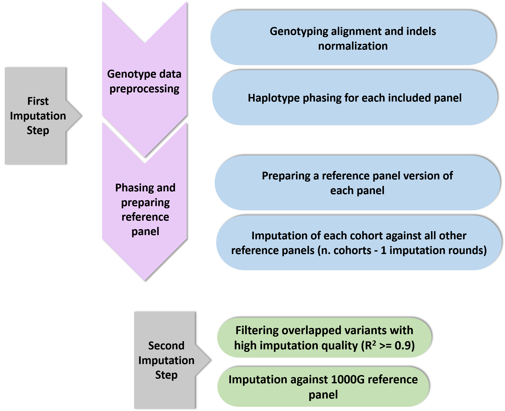

# Two-Step imputation workflow

This pipeline is designed to generate the intermediate panel that is required as an input for the two-step imputation workflow. The main workflow aims to overcome the technical bias due to batch effects between differently genotyped cohorts. The whole worflow is represented in the figure below.


Full description, testing and evaluation of the workflow is available in the manuscript.

## Table of Contents

- [Prerequisites](#Prerequisites)
- [Installation](#installation)
- [Outcome](#outcome)

### Prerequisites
- This project requires the follwoing softwares to be installed 
  [bcftools v1.14](https://samtools.github.io/bcftools/), [tabix 0.2.5](https://anaconda.org/bioconda/tabix), [minimac v4.1.4](https://genome.sph.umich.edu/wiki/Minimac4), [Eagle_v2.4.1](https://alkesgroup.broadinstitute.org/Eagle/), [VCFtools (0.1.17)](https://vcftools.sourceforge.net/index.html), and [perl](https://www.perl.org/get.html)
- It also requires the presence of fasta file of human g1k [human_g1k_v37.fasta](https://www.internationalgenome.org/category/grch37/) and [Genetic map file](https://data.broadinstitute.org/alkesgroup/Eagle/downloads/tables/) (all chromosomes in a single file) with recombination frequencies.
Beside installation, the pathway to their location on the device needs to be declared in the configuration file as will be clarified later. The pipeline is adjusted to human genome build 19, however, it can be modified to fit other genome builds.

The pipeline requires the QCed genotyping data of the autosomal chromosomes for included cohorts in the two-step imputation to be one VCF file per chromomse, distinguished by numbers from 1-22. Each cohort contains the genotyping data in a separate directory. For each cohort, the prefix and suffix of all chromosomes should be the same for each cohort.

We recommend performing minimal quality control measurements for genotype data before running the imputation pipeline, these measurements include:
- chromosome annotations in the VCF files (numerical instead of character)
- rare variant exclusion
- splitting multiallelic sites to biallelic records
- removing sites with missing call rates information
- sorting by chromosome and position


## Installation
Clone the repository on your working directory, either by direct downlaod or using the git clone command
```bash
git clone https://github.com/GenEpi-psych-UMG/Two_Step_Imputation.git
```

The repository includes stepwise scripts for the imputation workflow which require no further edits, only two files need to be edited before starting the imputation:

**1.  Cohorts_Info.csv**  
The table includes information about the genotyping cohorts, each row represents one cohort including the pathway to the genotype data. Example here for cohort "Cohort_A" where its VCF files are saved in the following format:

```bash
path/to/directory/Cohort_A_chr{i}.vcf.gz
```
For this cohort, the columns should be filled as follows:  
Cohort = Cohort_A  
Pathway= path/to/directory  
Prefix= Cohort_A_chr  
Suffix= .vcf.gz  

**PLEASE NOTE:**
- The pathway doesn't end with "/"
- It is better to use other text editors to update Cohorts_Info.csv rather than Microsoft excel

After updating Cohorts_Info.csv, make sure that it was saved in csv format.

**2. config.sh**  
Contains pathways and parameters needed for this eline. It is required to update the pathways of the working directory of the repository and other softwares in this file. There are other parameters included like number of used CPUs and iteration rounds for imputation that can work without modifications but are still modifiable according to the imputation's specific needs. 

## Usage

You can run the whole eline in one command 

which will take the working directory as an argument from the configuration source and run all commands of the eline at one time, after updating the cohort info and the configurations file just run the command:

```bash
bash path/to/directory/Run_all.sh <path/to/directory/config.sh>
```
Alternatively, you can run each script separately as follows:

**1. Alignment.sh**  
To insure the alignment of all included genotype data to the same strand, taking the location of fastafile as an input (from config.sh).

```bash
bash path/to/directory/Alignment.sh <path/to/directory/config.sh>
```

**2. vcf to bcf**  
Converting and indexing VCF files to BCF format for the following phasing step.

```bash
bash path/to/directory/VCF_BCF.sh <path/to/directory/config.sh>
```

**3. Phasing**  
Phasing of the included genotype data
```bash
bash path/to/directory/phase.sh <path/to/directory/config.sh>
```

**4. convert_refP**  
Before the first round of imputation, a msav format of the phased genotyped data needs to be prepared using the follwoing command:


```bash
bash path/to/directory/convert_RefP.sh <path/to/directory/config.sh>
```
**5. minimac4.sh**  
Running the imputation for all included cohorts, each cohort is imputed against all other included cohorts, all the output imputation files are saved in the same pathway of the imputed cohorts

```bash
bash path/to/directory/minimac4.sh <path/to/directory/config.sh>
```

**6. R_Input.sh**  
The script generates an info file for each imputed genotpe file (one info file for each chromosme per cohort), containing variant information including R2 imputation quality. This should by used by the following R-scripted algorithm for building the intermediate panel.

```bash
bash path/to/directory/R_Input.sh <path/to/directory/config.sh>
```

**7. R_Command.sh**  
This file runs the R algorithm (SNP_Selection.R) over the generated imputed gentoype files in step 5, the output of the algorithm is one filterout variants, which filter out variants from the corresponding imputed outcomes, and keep list files, which includes the variants to be filtered out from other imputed files. 

```bash
bash path/to/directory/R_Command.sh <path/to/directory/config.sh>
```

**8. VCF_Filter_Vcftools.sh**  
This script uses VCFtools software to apply the filtration lists generated from the R-script to filter imputed genotype variants generated in step 5. 

```bash
bash path/to/directory/VCF_Filter_Vcftools.sh <path/to/directory/config.sh>
```

**9. Merge_VCF_BCFtools.sh**   
The last step is to merge all the filtered files for each cohort into one vcf file per chromosome, the merging process is performed using BCF tools.

```bash
bash path/to/directory/Merge_VCF_BCFtools.sh <path/to/directory/config.sh>
```


## Outcome
For each included cohort, an output folder is generated in the genotype data directory containg the intermediate panel files for autosomal chromosmes, ready to be used as an input for the second imputation using global reference panel (e.g. Michigan imputation server).
